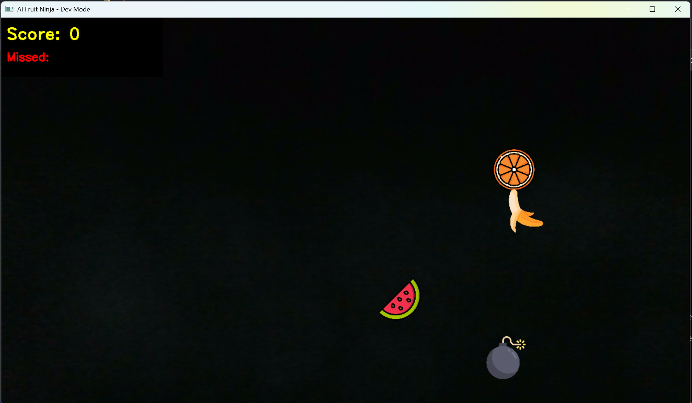
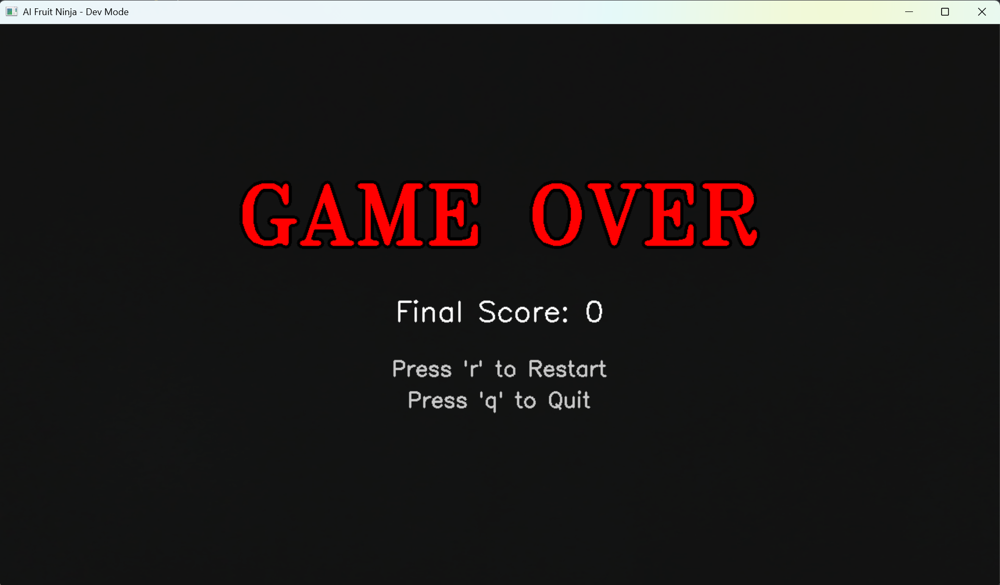

# 🍉 AI Fruit Ninja - Computer Vision Game

A Python-based interactive game that uses Computer Vision and Hand Tracking to recreate the classic "Fruit Ninja" experience. Slice fruits in the air using your finger captured by a webcam!


## 🚀 Features

* **Hand Tracking:** Real-time detection of the index finger to act as the "blade" using MediaPipe.
* **Visual Effects:** Dynamic sword trail (fading line) that follows your movement.
* **Sprite System:** Uses real PNG assets for fruits (Watermelon, Orange, Banana) and bombs.
* **Physics:** Fruits are launched with random velocities and affected by gravity.
* **Game Loop:**
    * **Score System:** Gain points by slicing fruits.
    * **Lives Mechanic:** You have 3 strikes. Missing a fruit costs a life.
    * **Game Over:** Triggered by hitting a **Bomb** or losing all 3 lives.
    * **Dynamic Difficulty:** Fruits spawn faster as your score increases.
* **Responsive UI:** The Game Over screen and text automatically adapt to different camera resolutions (720p, 1080p, etc.).

## 🛠️ Tech Stack

* **Python 3.x**
* **OpenCV (cv2):** For image processing and video capture.
* **MediaPipe:** For robust hand landmark detection.
* **NumPy:** For mathematical calculations.

## 📂 Project Structure
```text
ai-fruit-ninja/
├── assets/             # PNG images (sandia, naranja, bomb, banana, etc.)
├── src/
│   ├── detector.py     # HandDetector class (MediaPipe wrapper)
│   ├── game.py         # Fruit class and physics logic
│   └── utils.py        # Helper functions (overlay_transparent)
├── main.py             # Main game loop
├── requirements.txt    # Dependencies
└── README.md           # Documentation
```

## 📦 Installation

### Clone the repository
```bash
git clone https://github.com/AxelT456/ai-fruit-ninja.git
cd ai-fruit-ninja
```

### Create a Virtual Environment (Optional but recommended)
```bash
# Windows
python -m venv venv
venv\Scripts\activate

# Mac/Linux
python3 -m venv venv
source venv/bin/activate
```

### Install Dependencies
```bash
pip install opencv-python mediapipe numpy
```

Or use the requirements file:
```bash
pip install -r requirements.txt
```

## 🎮 How to Play

1. **Run the main script:**
```bash
   python main.py
```

2. **Stand back:** Ensure your webcam can see your hand clearly.

3. **Use your Index Finger:** Move your finger to control the blade.

4. **Slice Fruits:** Cut the fruits to gain points.

5. **Avoid Bombs:** Touching a bomb ends the game immediately!

6. **Don't Miss:** If a fruit falls off the screen without being sliced, you lose a life (X).

### Controls

* `q`: Quit the game
* `r`: Restart the game (available on the Game Over screen)

## 📸 Screenshots

### Gameplay


### Game Over



## 🤝 Contributing

Contributions are welcome! Feel free to open issues or submit pull requests to improve the game mechanics or add new features.

## 📧 Contacto

axurmen214@gmail.com
Develop by Axel Tapia 🐐
